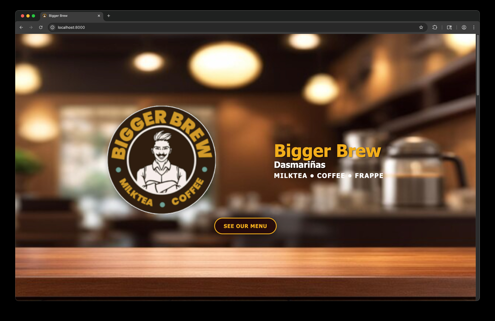
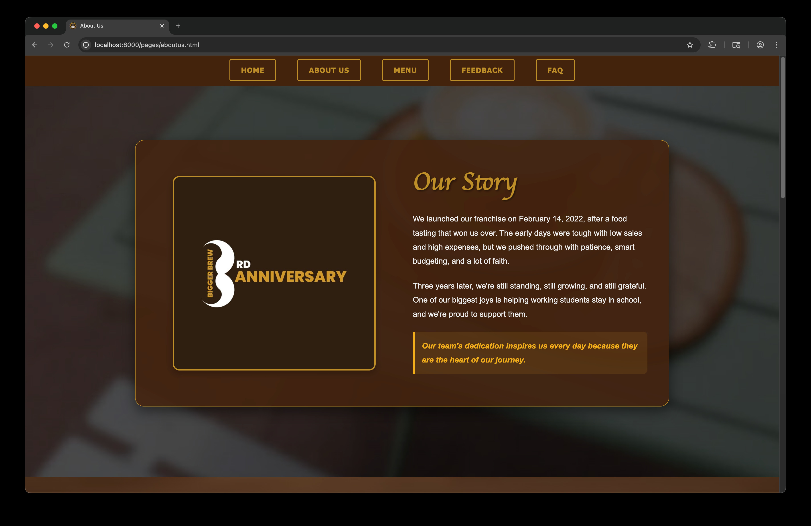
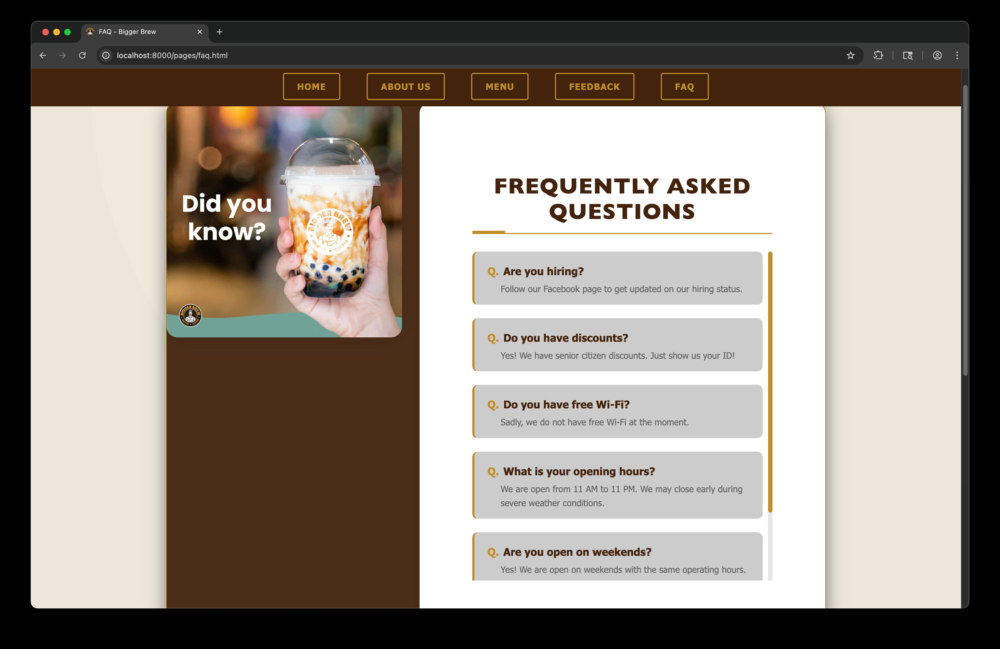

# Bigger Brew Cafe Website Project

<p align="center">
  
  
  
</p>

[**View Full Showcase**](SHOWCASE.md)

> **⚠️ IMPORTANT:** Do not try to run this project by simply double-clicking `index.html`! This website uses JavaScript modules and Web Components which require a local server to function correctly due to browser security policies (CORS). Please see the [Local Deployment](#local-deployment) section for instructions.

This is the official front-end repository for the Bigger Brew Cafe website. This project was developed as a college project and is ready for deployment and use by the cafe owner.

## **Project Overview**
The Bigger Brew Cafe website is designed to be a modern, responsive, and easy-to-navigate online presence.

Key Features:
 * **Responsive Design**: Optimized for viewing on mobile phones, tablets, and desktop computers.
 * **Menu Display**: Dedicated sections for displaying coffee and food menus.
 * **Customer Feedback**: An anonymous feedback form for collecting customer comments and suggestions.
 * **Privacy Transparency**: A clear, non-technical Privacy Policy accessible via a modal window in the footer.

## **Technical Information and Setup**
This section provides details needed for hosting, maintenance, and future updates.

### Core Tech Stack (Technologies Used)
 * **HTML5**: Structure and Content
 * **CSS3 (Custom CSS)**: Modular styling with specific stylesheets for different pages and components
 * **JavaScript (Vanilla)**: Provides all front-end interactivity and logic (e.g., handling buttons, animations, and form responses). Additionally uses standard Custom Elements (e.g., `<nav-bar>`, `<footer-section>`, `<menu-section>`) for reusable UI components and modularity without external frameworks
 
### **Project Files**
The necessary files for deployment are:

 * **index.html**: The landing page containing the Hero, About, and Menu Preview sections.
 * **pages/**: Directory containing sub-pages (`menu.html`, `aboutus.html`, `faq.html`, `feedback.html`).
 * **css/**: Directory containing modular stylesheets. `styles.css` is the main entry point, while others (e.g., `menu.css`, `nav.css`) target specific features.
 * **js/**: Directory containing JavaScript logic.
   * **components/**: Contains Web Component definitions for the navigation bar, footer, and menu rendering logic.
 * **images/**: Folder containing background images, product photos, and UI assets.

### **Deployment Instructions**
This website consists of static files (HTML, CSS, JS) and can be hosted on nearly any web service.

Upload the entire project folder (including `index.html`, `pages/`, `css/`, `js/`, and `images/`) to your hosting provider's root directory. Ensure `index.html` is accessible as the primary page.

#### Local Deployment
To run this project locally on your machine, you must use a local web server. Opening `index.html` directly in your browser will result in broken functionality (missing navigation, footer, and styles) because the project relies on absolute paths and JavaScript modules that browsers block for local files (`file://` protocol) for security reasons.

**How to run locally:**
1. Ensure you have Python installed.
2. Open a terminal/command prompt in the project's root directory.
3. Run the following command:
   ```bash
   python -m http.server
   ```
4. Open your browser and go to `http://localhost:8000`.

### **Maintenance**
* **Menu Updates**: To change menu items or prices, edit **[pages/menu.html](pages/menu.html)**. The menu is built using custom tags (e.g., `<menu-item name="..." price="...">`), making it easy to modify without touching complex code.
* **Content Updates**: To change text, edit the relevant HTML file (e.g., `index.html` for the home page, `pages/aboutus.html` for the about us page).
* **Global Elements**: The Navigation Bar and Footer are Web Components defined in `js/components/`. Changes made in those files will reflect across all pages automatically.
 
## **Future Development & Updates**
This website is ready to use, but here are suggestions for future enhancements:

1. **Backend Integration**: The current feedback form is a front-end placeholder. It needs a database connection (e.g., Firebase, MongoDB) to actually store submitted comments.
2. **Content Management System (CMS)**: Implement a CMS (like WordPress or Shopify) to allow the cafe owner to update the menu and text without editing the underlying code.
3. **Order Integration**: Add a feature for online ordering and payment processing.
 
## **College Project Team**
This project was a collaborative effort by the 1st Year BSCS Students of the Lyceum of the Philippine University, Class of 2025-2026.

Team Members and Roles:
 * **Michael Baterna**: JavaScript Developer
 * **Arwin Jeremy Bumpus**: JavaScript Developer
 * **Shogo Numano**: CSS Designer
 * **Jaylen Lee**: CSS Designer
 * **Razmir Arguelles**: CSS Designer
 * **Ivan Cedrick Busto**: HTML Developer
 * **Sean Michael Malubag**: HTML Developer